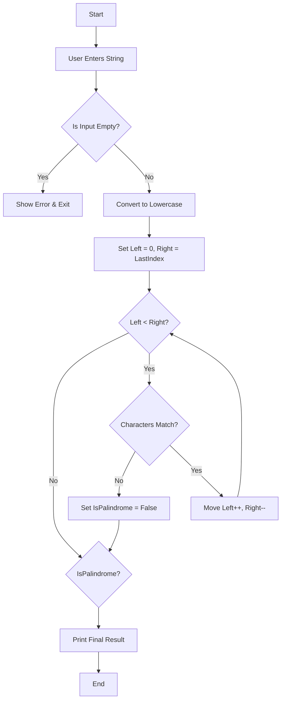

# Question 1:  Write a C# program to check whether a string is a palindrome.

This project is a C# Console Application that determines whether a given string is a palindrome (a word that reads the same backward as forward, such as "radar" or "madam").

---

## 1. Logic & Algorithm Hierarchy

The program uses the **Two-Pointer Technique**, which is the most efficient way to check for palindromes as it only requires a single pass through half of the string.

### **The Step-by-Step Logic:**
1.  **Input Acquisition:** The program prompts the user for a string.
2.  **Validation:** It checks if the input is null or empty to prevent errors.
3.  **Normalization:** The input is converted to **lowercase** using `.ToLower()` to ensure the check is case-insensitive (e.g., 'Racecar' becomes 'racecar').
4.  **The Comparison Engine:**
    * Initialize a `leftSide` pointer at index `0`.
    * Initialize a `rightSide` pointer at the last index (`length - 1`).
    * While the `leftSide` is less than the `rightSide`:
        * Compare the characters at these two positions.
        * If they **do not match**, the word is not a palindrome; stop the loop immediately.
        * If they **do match**, move the `leftSide` forward and the `rightSide` backward to check the next pair.
5.  **Output:** Display a friendly result to the user based on the boolean flag.

---

## 2. Logic Flowchart

---

## 3. How to Run the Program

You can run this program using Visual Studio Code or your system terminal:

Open your terminal (Command Prompt, PowerShell, or Bash).

Navigate to the Question 1 folder:

**Bash** 
cd Question1 

**Bash** 
dotnet run 

Execute the application using the .NET CLI:

---

## 4. Expected Output Example

**Example 1: Palindrome Input** 
Plaintext 
--- Palindrome Checker --- 
Enter a word to check if it is a palindrome: Racecar 

--- Result --- 
Yes! 'Racecar' is a palindrome...... 

**Example 2: Non-Palindrome Input** 
Plaintext 
--- Palindrome Checker --- 
Enter a word to check if it is a palindrome: Hello 

--- Result --- 
No, 'Hello' is not a palindrome...... 
