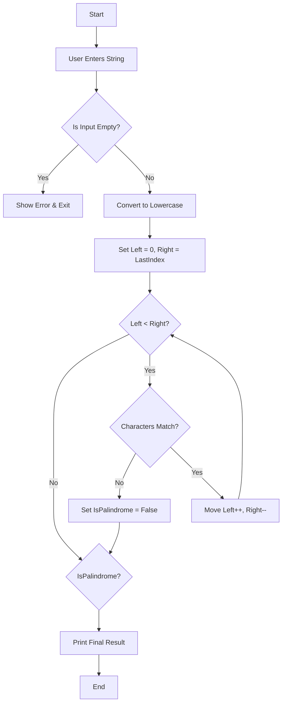

# Question 1: Write a C# Program to Check Whether a String is a Palindrome

This project is a **C# Console Application** that determines whether a given string is a **palindrome** (a word that reads the same backward as forward, such as *"radar"* or *"madam"*).

---

## 📌 1. Logic & Algorithm Hierarchy

The program uses the **Two-Pointer Technique**, which is efficient because it only checks **half of the string**.

### 🔍 Step-by-Step Logic

1. **Input Acquisition**  
   ➤ The program asks the user to enter a string.

2. **Validation**  
   ➤ Checks if the input is empty or null to avoid errors.

3. **Normalization**  
   ➤ Converts the string to lowercase using `.ToLower()`  
   ➤ Example: `"Racecar"` → `"racecar"`

4. **Comparison Logic (Two-Pointer Technique)**  
   ➤ Set `leftSide = 0`  
   ➤ Set `rightSide = length - 1`  

   🔁 While `leftSide < rightSide`:
   - Compare characters at both ends  
   - ❌ If not equal → Not a palindrome (stop)  
   - ✅ If equal → Move pointers inward  
     - `leftSide++`  
     - `rightSide--`

5. **Final Output**  
   ➤ Display result based on comparison

---

## 🔄 2. Logic Flowchart

---

## 3. How to Run the Program

You can run this program using Visual Studio Code or your system terminal:

Open your terminal (Command Prompt, PowerShell, or Bash).

Navigate to the Question 1 folder:

**Bash** 
cd Question1 

**Bash** 
dotnet run 

Execute the application using the .NET CLI:

---

## 4. Expected Output Example

**Example 1: Palindrome Input** 
Plaintext 
--- Palindrome Checker --- 
Enter a word to check if it is a palindrome: Racecar 

--- Result --- 
Yes! 'Racecar' is a palindrome...... 

**Example 2: Non-Palindrome Input** 
Plaintext 
--- Palindrome Checker --- 
Enter a word to check if it is a palindrome: Hello 

--- Result --- 
No, 'Hello' is not a palindrome...... 
