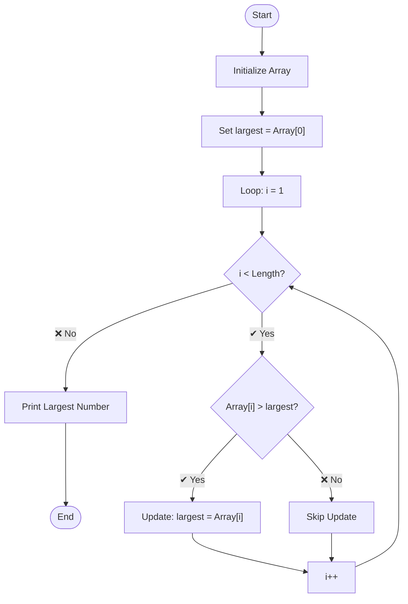

# Question 2: Write a Program to Find the Largest Number in an Array

This project is a **C# Console Application** that identifies the maximum value within a predefined set of integers. It demonstrates fundamental **array traversal** and **comparison logic**.

---

## 📌 1. Algorithm Description

The program follows a **linear search approach** to find the maximum value:

- ➤ **Initialize**  
  Create an array of integers  

- ➤ **Assume**  
  Set the first element as the initial `largestNumber`  

- ➤ **Iterate**  
  Start loop from index `1` to the end  

- ➤ **Compare**  
  Check if current element > `largestNumber`  

- ➤ **Update**  
  If ✔ true → update `largestNumber`  

- ➤ **Result**  
  Final value stored is the largest number  

---

## 🔄 2. Logic Flowchart



---

## 📁  3. Project Structure
Question2/<br>
├── Program.cs          # Main source code containing the logic<br>
├── Question2.csproj    # .NET project configuration file<br>
├── Question2.sln       # Visual Studio Solution file<br>
└── README.md           # Project documentation (this file)<br>


---

## ▶️ 4. How to Run the Program

**Step 1: Open Terminal**
Open Command Prompt, PowerShell, or VS Code Terminal.

**Step 2: Navigate to Project Folder**
```bash
cd Question2
```

**Step 3: Run the Program**

```bash
dotnet run
```

## 💻 5. Expected Output

When you run the program, it will display:<br>
--- Largest Number Finder ---<br>
Let's find the biggest number in our list!<br>

List of numbers: 15, 82, 4, 99, 23, 42<br>

--- Result ---
Largest number is: 99
-----------------------------

