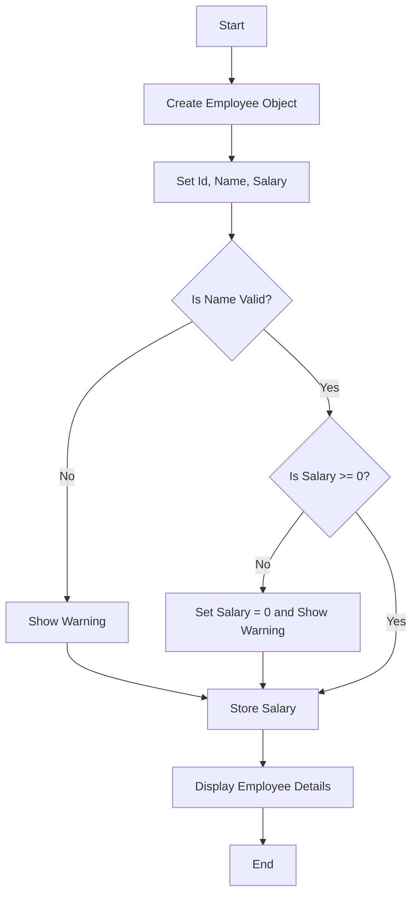

# Question 3: Create a class Employee with properties (Id, Name, Salary) and demonstrate encapsulation.

This project demonstrates **Encapsulation in C#** by creating an `Employee` class with properties such as **Id, Name, and Salary**. It ensures data safety by using private fields and public properties with validation logic.

---

## 📌 Algorithm

The program follows these steps:

1. **Create Class**
   - Define an `Employee` class with private fields: `_id`, `_name`, `_salary`.

2. **Encapsulation**
   - Use public properties (`Id`, `Name`, `Salary`) to control access.

3. **Validation Rules**
   - Name should not be empty.
   - Salary should not be negative.

4. **Create Object**
   - Instantiate an `Employee` object in `Main()`.

5. **Assign Values**
   - Set values using properties.

6. **Validation Check**
   - Try assigning invalid values (like negative salary).

7. **Display Output**
   - Print employee details and validation results.

---

## 🔄 Flowchart



## 📁 Project Structure

Question3/<br>
├── Program.cs # Main program with Employee class and logic<br>
├── Question3.csproj # .NET project configuration<br>
├── Question3.sln # Solution file<br>
└── README.md # Documentation<br>


---

## ▶️ How to Run the Program

**Step 1: Open Terminal**
Open Command Prompt / PowerShell / VS Code Terminal.

**Step 2: Navigate to Folder**
```bash
cd Question3
```
**Step 3: Run the Program**
```bash
dotnet run
```

## Expected Output
--- Employee Encapsulation Demo ---<br>
ID: 101 | Name: Samruddhi Kangude | Salary: Rs. 60000<br>

--- Testing Validation ---<br>
Warning: Salary cannot be less than zero. Setting it to 0 instead.<br>
Updated Salary: Rs. 0<br>

## ✅ Conclusion

**This project demonstrates:**

1. Encapsulation using private fields and public properties<br>
2. Data validation<br>
3. Secure and controlled access to class data<br>

It is a fundamental concept in Object-Oriented Programming (OOP).
