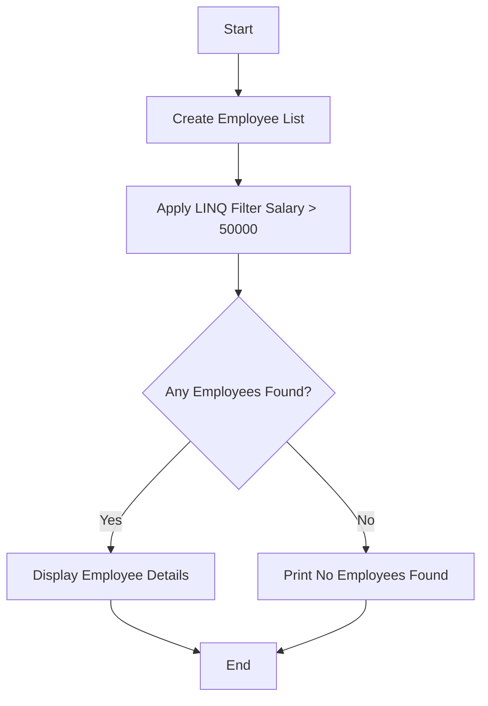

# Question 4: LINQ Query to Filter Employees with Salary > 50,000

This project is a **C# Console Application** that demonstrates the use of **LINQ (Language Integrated Query)** to filter employees based on their salary.

The program retrieves employees earning more than **₹50,000** using the `.Where()` method.

---

## 1. Problem Statement

Write a LINQ query to filter employees whose salary is greater than **50,000**.

---

## 2. Algorithm

The program follows these steps:

- **Initialize**: Create a list of employees with Id, Name, and Salary.
- **Filter**: Use LINQ `.Where()` method to select employees with `Salary > 50000`.
- **Store Result**: Convert filtered data into a list using `.ToList()`.
- **Display**: Print the filtered employees.
- **Check Condition**: If no employees match, display a message.

---

## 3. Logic Flowchart


## 4. Project Structure
Question4/<br>
├── Program.cs          # Main program logic<br>
├── Employee.cs         # Employee class (if separated)<br>
├── Question4.csproj    # Project configuration<br>
├── Question4.sln       # Solution file<br>
└── README.md           # Documentation<br>

## 5. How to Run the Program

**Step 1: Open Terminal**
Open Command Prompt / PowerShell / VS Code Terminal.

**Step 2: Navigate to Project Folder**
```bash
cd Question4
```
**Step 3: Run the Program**

```bash
dotnet run
```

## 6. Expected Output
--- Employee Salary Filter (LINQ Demo) ---<br>
Searching for employees earning more than Rs. 50,000...<br>

--- High Earners List ---<br>
- Samruddhi Kangude (Salary: Rs. 85000)<br>
- Jui Kangude (Salary: Rs. 65000)<br>
- Sneha Patil (Salary: Rs. 82000)<br>
-------------------------

## 7. Code Overview
**Employee Class**<br>
Defines Id, Name, and Salary.<br>

**LINQ Query**<br>
```bash
var highEarners = team.Where(emp => emp.Salary > 50000).ToList();
```
**Filtering Logic**
Uses lambda expression to filter employees.

## 8. Conclusion

**This project helps understand:**

1. LINQ basics (Where, ToList)
2. Filtering collections
3. Lambda expressions in C#

**It is a beginner-friendly example for learning LINQ in C#.**
