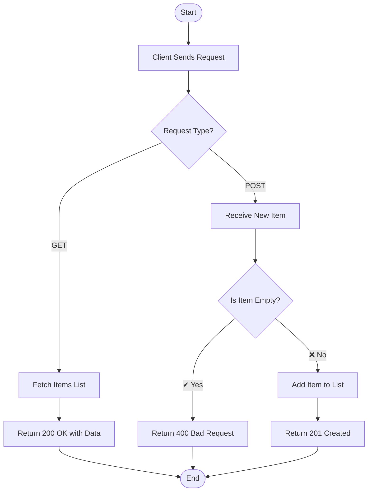

# Question 5: Build a Simple ASP.NET Core Web API (GET & POST)

This project is a **simple ASP.NET Core Web API** that demonstrates how to create:

- ✔ A **GET method** to retrieve data  
- ✔ A **POST method** to add new data  

It uses an in-memory list to simulate a database.

---

## 📌 1. Problem Statement

Build a simple Web API with:
- ➤ One **GET endpoint** to fetch items  
- ➤ One **POST endpoint** to add items  

---

## ⚙️ 2. Algorithm / Logic

### 🔹 GET Method (`/api/items`)
- ➤ Receive request  
- ➤ Fetch list of items  
- ➤ Return response with **200 OK**

### 🔹 POST Method (`/api/items`)
- ➤ Receive input data (`newItem`)  
- ➤ Validate input (not null/empty)  
- ➤ If ❌ invalid → return **400 Bad Request**  
- ➤ If ✔ valid → add item to list  
- ➤ Return **201 Created** response  

---

## 🔄 3. Logic Flowchart



## 📁 4. Project Structure

Question5/<br>
├── Controllers/<br>
│ └── ItemsController.cs #  API controller (GET & POST methods)<br>
├── Program.cs #  Entry point of application<br>
├── appsettings.json # Configuration file<br>
├── Question5.csproj #  Project configuration<br>
├── Question5.sln # Solution file<br>
└── README.md # Documentation<br>


---

## ▶️ 5. How to Run the Program

**🔹 Step 1: Open Terminal**
➤ Use Command Prompt / PowerShell / VS Code Terminal  

**🔹 Step 2: Navigate to Project Folder**  
```bash
cd Question5
```

**🔹 Step 3: Run the API**

```bash
dotnet run
```

## 📡 6. API Endpoints
**🔹 GET Request**
URL: /api/items<br>
Method: GET<br>

**✔ Response<br>**

["Laptop", "Mouse", "Keyboard"]

**🔹 POST Request**
URL: /api/items<br>
Method: POST<br>

**Body**

"Mobile"<br>

**✔ Success Response**

Success! 'Mobile' was added.<br>

**❌ Error Response**

Error: Item cannot be empty.<br>

## 💻 7. Expected Output
**✔ GET Output (Swagger / Browser)**
["Laptop", "Mouse", "Keyboard"]
**✔ POST Output**
Success! 'Mobile' was added.

## ✅ 8. Summary

✔ Demonstrates REST API basics<br>
✔ Uses GET & POST methods<br>
✔ Shows status codes (200, 201, 400)<br>
✔ Beginner-friendly ASP.NET Core project<br>

## 📚 Concepts Covered
1. Web API development<br>
2. HTTP methods<br>
3. Request & response handling<br>
4. Controller-based architecture<br>
