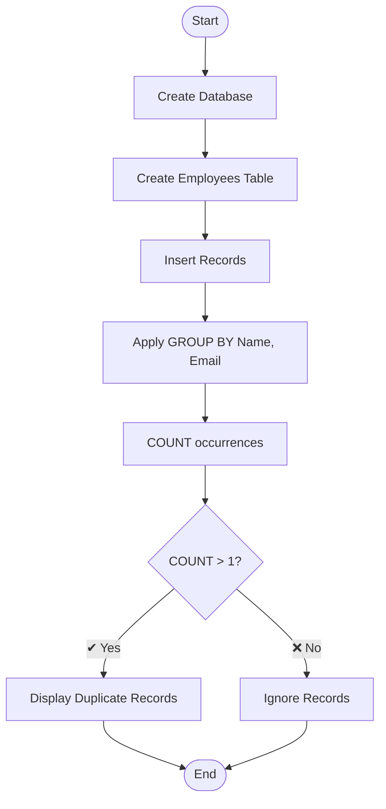

# Question 6: Write a SQL Query to Find Duplicate Records in a Table

This project demonstrates how to identify **duplicate records** in a database table using SQL. It uses **MySQL** and can be executed in **MySQL Workbench**.

---

## 📌 1. Problem Statement

Write a SQL query to find duplicate records in a table based on specific columns (e.g., Name and Email).

---

## 🛠️ 2. Requirements
  
- ✔ MySQL Workbench
- ✔ SQL (MySQL)

---

## ⚙️ 3. Algorithm

The query follows these steps:

- ➤ **Create Database**  
  Create a database to store data  

- ➤ **Create Table**  
  Define `Employees` table with columns  

- ➤ **Insert Data**  
  Add sample records (including duplicates)  

- ➤ **Group Data**  
  Use `GROUP BY` on Name and Email  

- ➤ **Count Records**  
  Use `COUNT(*)` to count occurrences  

- ➤ **Filter Duplicates**  
  Use `HAVING COUNT(*) > 1`  

- ➤ **Result**  
  Display duplicate records  

---

## 🔄 4. Logic Flowchart

## 📁 5. Project Structure

Question6/ 
├── Query.sql # 📄 SQL script (database + query) 
└── README.md # 📘 Documentation 

---

## ▶️ 6. How to Run in MySQL Workbench

**🔹 Step 1: Open MySQL Workbench**
➤ Launch MySQL Workbench and connect to your server  

**🔹 Step 2: Open SQL File**
➤ Open `Query.sql` or paste the SQL code  

**🔹 Step 3: Execute Script**
➤ Click ⚡ (Execute) or press `Ctrl + Shift + Enter`  

**🔹 Step 4: View Output**
➤ Check the result grid for duplicate records  

---

## 💻 7. Expected Output

| Name              | Email                         | DuplicateCount |
|:------------------|:-----------------------------|--------------:|
| Samruddhi Kangude | samruddhikangude20@gmail.com | 3              |
| Ramesh Kumar      | ramesh@gmail.com             | 3              |
| Shruti Kanade     | skangude77@gmail.com         | 2              |

--- 

✅ 8. Conclusion

✔ Uses GROUP BY + HAVING to detect duplicates 
✔ Efficient and widely used SQL technique 
✔ Helps in data cleaning and validation 

## 📚 Key Concepts Learned
1. GROUP BY clause 
2. HAVING clause 
3. Aggregate functions (COUNT) 
4. Data filtering 

**This is a fundamental SQL problem useful in real-world database management.**
